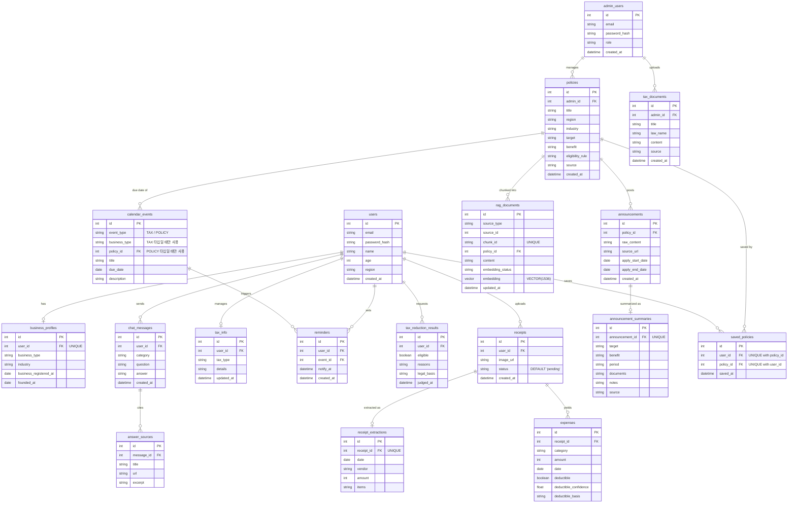

# ERD

`Docs/API_SPEC.md`, `Docs/FUNCTIONAL_SPEC.md`에서 드러난 데이터를 기준으로 정리한 관계형 스키마다.

## 모델링 노트

- **User – BusinessProfile**: 1:1. 개인정보(FS-03)와 사업자 정보(FS-04)를 분리해 API도 별도 엔드포인트로 관리한다.
- **User – ChatMessage – AnswerSource**: 챗봇 질의응답(FS-05~07)과 답변 근거(FS-08)를 1:N으로 연결해, 답변마다 근거 문서를 복수로 저장할 수 있게 한다.
- **CalendarEvent – Reminder**: `CalendarEvent`는 홈 화면 캘린더(FS-11)에 노출되는 일정 마스터 데이터로, `event_type`에 따라 세금 신고 일정(TAX, `business_type` 사용)과 지원정책 신청 마감일(POLICY, `policy_id` 사용)을 함께 담는다. `Reminder`는 사용자가 특정 일정(세금·지원금 무관)에 건 알림이다.
- **Policy – CalendarEvent**: 정책의 신청 마감일(`Announcement.apply_end_date`)을 기준으로 생성되는 POLICY 타입 `CalendarEvent`를 위한 관계다. `Announcement`에 `apply_start_date`/`apply_end_date` 구조화 필드를 추가한 이유는, `AnnouncementSummary.period`가 AI 요약 문자열이라 캘린더 렌더링에 쓸 신뢰 가능한 날짜 값이 아니기 때문이다.
- **Receipt – ReceiptExtraction – Expense**: 영수증 등록(FS-14) → OCR 추출 결과(FS-15, 1:1) → 지출 항목(FS-16, FS-17 포함, 1:N) 순서로 이어진다. 영수증 한 장에 여러 지출 항목이 나올 수 있어 `Expense`는 `Receipt`의 자식으로 둔다.
- **Policy – Announcement – AnnouncementSummary**: 정책(마스터 데이터) 하나에 여러 시점의 공고문이 달릴 수 있고(1:N), 공고문 하나는 AI 요약 결과 하나를 가진다(1:1).
- **User – Policy (SavedPolicy)**: 관심 정책 저장(FS-23)을 위한 다대다 조인 테이블.
- **AdminUser – Policy / TaxDocument**: 관리자가 등록한 데이터의 출처를 추적하기 위한 FK.
- **RagDocument**: 원천 문서 참조와 실제 FK가 섞여 있는 구조다.
    - `source_type`(`tax_document`/`policy`/`announcement`) + `source_id`: `tax_documents`·`policies`·`announcements` 여러 테이블을 대상으로 하므로 DB 레벨 FK를 걸지 않은 논리적 참조다. 벡터DB 임베딩 상태(FS-27)도 여기서 추적한다.
    - `policy_id`: `policies(id)`를 가리키는 실제 FK다. 정책 단위 검색 필터(`LLM/src/vectorstores/postgres.py:170`)와 정책 제목 조인(`:162`)에 쓰인다. 세법 문서 청크는 이 값이 `NULL`이라 관계가 `0..*`다.
    - `chunk_id`: 청크 본문 hash 기반 UNIQUE 키다. 재색인 시 `ON CONFLICT (chunk_id) DO UPDATE`(`LLM/src/vectorstores/postgres.py:82`)로 중복 삽입 대신 갱신한다.
    - ⚠️ `policy_id` FK 때문에 `policies` 행을 지우면 CASCADE로 `rag_documents`의 해당 청크도 함께 사라진다. 정책 테이블을 다루는 마이그레이션·정리 스크립트는 이 점을 전제해야 한다. Backend가 쓰기마다 `TRUNCATE policies ... CASCADE`를 실행하던 경로는 제거됐다 (`Docs/STATUS.md` P0-3).
- **PolicyEligibility(FS-20)**: 별도 테이블로 저장하지 않는다. `Policy.eligibility_rule`과 `User`/`BusinessProfile` 값을 요청 시점에 비교해 계산하는 값이라 저장이 불필요하다.
- **시스템 모니터링(FS-28)**: 관계형 DB 엔티티로 모델링하지 않는다. 로그/지표 수집은 별도 관측 도구 영역으로 본다.

## 구현 노트

위 다이어그램은 `DB/01_schema.sql`(PostgreSQL + pgvector)의 실제 테이블 구조에 맞춰 동기화했다. 컬럼 단위 제약(`NOT NULL`, `ON DELETE CASCADE` 등)과 `01_schema.sql` 작성 시점의 세부 결정 사유는 중복 기술하지 않고 `DB/01_schema.sql` 하단 "ERD와 다른 사항" 주석을 참조한다.

### 스키마에 없는데 Backend가 참조하는 항목

Backend가 도메인 데이터로 다루지만 `DB/01_schema.sql`에는 없는 테이블·컬럼이다. 참조 위치는 `Backend/core/database.py`의 SQLite DDL 기준이다. Backend가 Postgres에 쓰던 경로는 제거됐으므로 당장 오류를 내지는 않지만, Backend를 DB 직접 조회로 전환할 때(`Docs/STATUS.md` P1-1) 반드시 채워야 한다. 위 다이어그램은 SQL 기준이라 반영하지 않고 목록으로만 남긴다.

| 대상 | 없는 항목 | SQLite DDL | 판단 |
| --- | --- | --- | --- |
| 테이블 | `notifications` | `database.py:167` | 실제 도메인. 알림함이 `kind`·`title`·`body`·`channel`·`status`·`read_flag`를 쓴다. 다만 ERD와 `Docs/Design/API_SPEC.md` 어디에도 없어 설계 문서 갱신이 함께 필요하다 |
| 테이블 | `meta_ids` | `database.py:163` | **추가하지 않는다.** 인메모리 id 카운터를 저장하려던 덤프 산출물이다. `SERIAL`을 쓰면 개념 자체가 사라진다 |
| `users` | `phone`, `status` | `database.py:28-29` | 실제 도메인 필드 |
| `reminders` | `dispatched` | `database.py:90` | 실제 도메인 필드(알림 발송 여부) |
| `announcements` | `apply_method` | `database.py:133` | 실제 도메인 필드. `API_SPEC.md`의 `GET /policies/{policyId}` 응답에 `applyMethod`가 있다 |
| `announcement_summaries` | `llm_used` | `database.py:145` | 실제 도메인 필드 |
| `calendar_events` | `user_id` | `database.py` | 설계에 없는 세 번째 `event_type` `USER`(사용자가 직접 만든 일정)에 쓴다(`Backend/services/calendar_service.py:67`). 기능을 인정할지 걷어낼지 결정 필요 |
| `expenses` | `user_id` | `database.py` | 비정규화. ERD는 `receipt_id → receipts.user_id`로 유도한다. 컬럼 추가와 JOIN 중 선택 필요 |

### SQL 파일 자체의 미해결 항목

- `DB/scripts/09_add_rag_columns.sql`은 `01_schema.sql:165-175`가 이미 만든 `chunk_id`/`policy_id`/`content`를 다시 `ADD COLUMN` 한다. `DB/run_all.sh` 순서대로 실행하면 `column "chunk_id" of relation "rag_documents" already exists`로 실패한다.
- `DB/run_all.sh:2` 주석의 스키마 경로는 `scripts/01_schema.sql`이지만 실제 파일은 `DB/01_schema.sql`이다.
- `rag_documents.embedding`에 벡터 인덱스가 없다. 저장소 전체에 `ivfflat`/`hnsw`/`vector_cosine_ops`가 한 번도 나오지 않아 유사도 검색이 전건 스캔이다.
- 스키마 부트스트랩은 `docker-compose.yml`의 initdb 마운트가 유일한 경로다. Backend가 존재하지 않는 `DB/schema.sql`·`DB/app_extras.sql`을 읽으려던 코드는 제거됐다.
