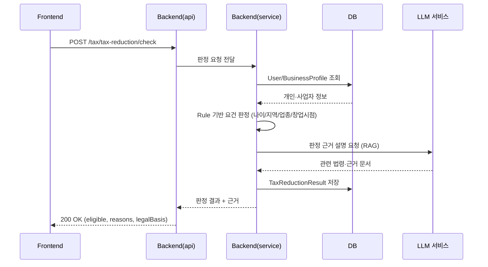
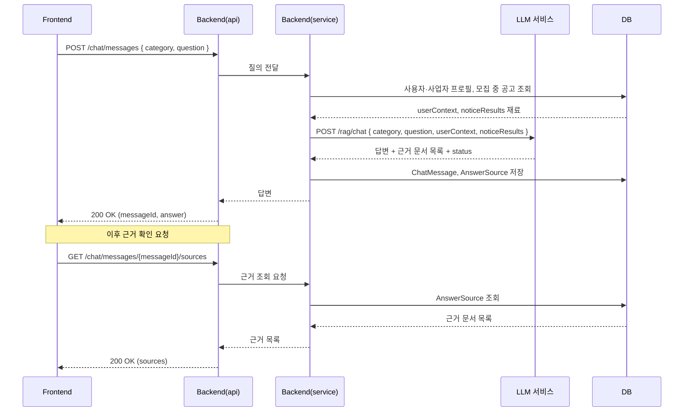
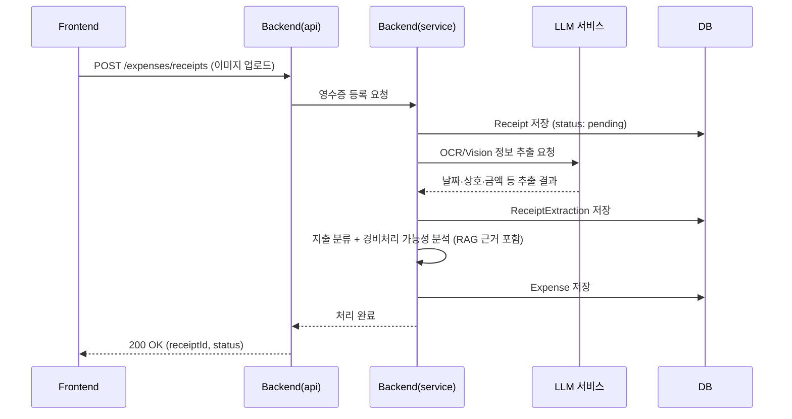
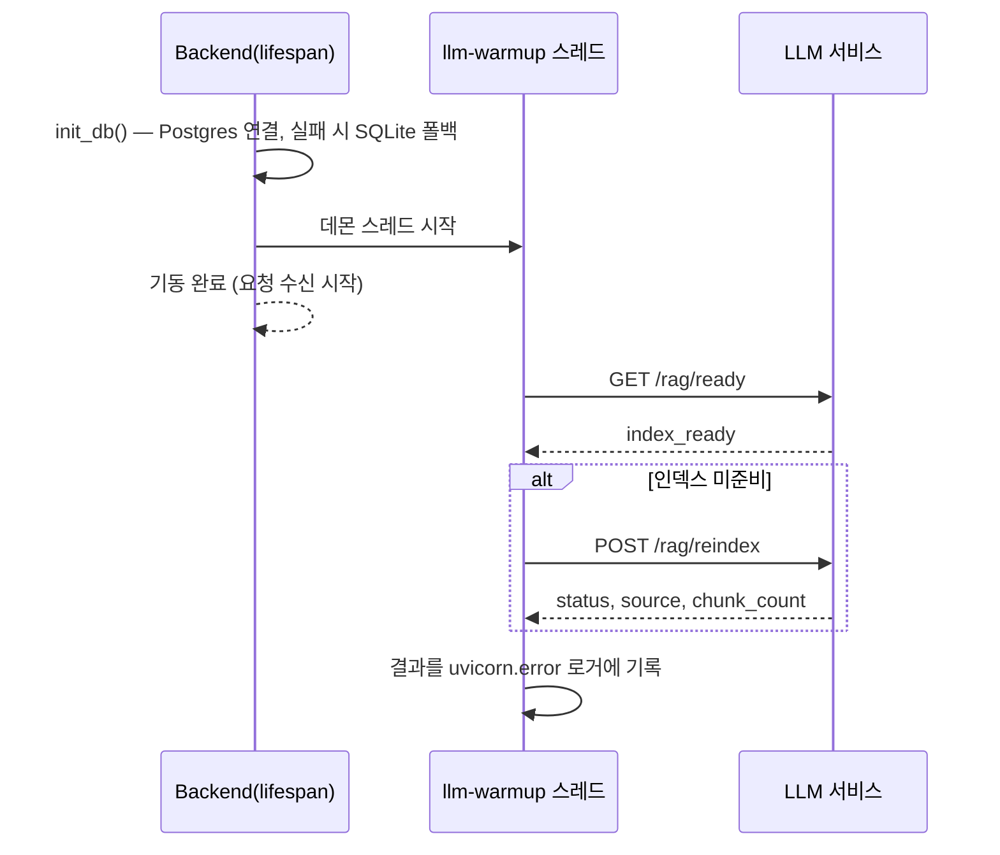

# 시퀀스 다이어그램

핵심 유스케이스의 컴포넌트 간 호출 흐름을 정리한다. 참여자 구성은 `Docs/Design/ARCHITECTURE.md`의 계층 명칭(Controller=`Backend/api`, Service=`Backend/services`)을 그대로 따른다.

## 1. 청년창업 세액감면 자동판정 (FS-13)

Rule 기반 판정과 RAG 근거 제시를 결합하는 것이 핵심 차별점(FS-13)이므로, Service가 판정 로직을 직접 수행한 뒤 LLM 서비스에는 근거 설명만 요청하는 구조로 그렸다.

## 2. AI 챗봇 Q&A + 답변 근거 확인 (FS-05, FS-06, FS-08)

답변 생성 시점에 근거 문서를 함께 저장해두므로, 이후 "답변 근거 확인"(FS-08)은 LLM을 다시 호출하지 않고 DB 조회만으로 처리한다.

Service는 LLM을 부르기 전에 두 가지를 조립한다(`Backend/services/chat_service.py`).

- `userContext`: 나이·지역·사업자 유형·업종·사업자등록일·창업일. 로그인 사용자의 프로필에서 만든다
- `noticeResults`: 모집 중 공고 목록. 공고 본문은 `NOTICE_TEXT_LIMIT`(800자)로 자른다

**실제 공고 조회는 Backend가 한다.** LLM은 넘겨받은 목록을 근거로 쓸 뿐 DB를 직접 뒤지지 않는다(`Docs/Design/LLM_API_SPEC_V1.md` 10절 역할 경계).
근거 문서를 못 찾으면 LLM이 `status`로 알리고, Backend는 그 값을 그대로 보존해 화면이 "확인 필요"로 안내하게 한다.

## 3. 영수증 지출 분석 (FS-14 ~ FS-17)

영수증 등록(FS-14) → OCR 추출(FS-15) → 지출 분류(FS-16) → 경비처리 가능성 분석(FS-17)이 하나의 흐름으로 이어지며, Frontend는 등록 요청 한 번만 보내고 나머지는 Backend/LLM이 내부에서 처리한다.

## 4. 기동 시 RAG 인덱스 워밍업

인덱스가 준비되지 않은 채로는 모든 질의가 목업으로 끝나므로, 누가 재색인을 부를 때까지 기다리지 않고 기동 시 한 번 확인한다(`Backend/main.py`의 lifespan → `Backend/core/llm_client.py`의 `ensure_index_ready`).

데몬 스레드로 도는 이유는 워밍업이 기동을 막지 않게 하기 위해서다. `rag_documents`가 이미 임베딩을 갖고 있으면 `index_source: "cache"`로 로드되어 OpenAI 재호출이 없다.

**질의마다 준비 상태를 확인하던 예전 동작과 혼동하면 안 된다.** 그 왕복은 제거됐고(`Docs/STATUS.md` P0-2-1), 이것은 기동 시 한 번 도는 워밍업이다.

## 관련 문서

- 전체 시스템 구성·계층 구조: `Docs/Design/ARCHITECTURE.md`
- 기능 정의: `Docs/Design/FUNCTIONAL_SPEC.md`
- 데이터 구조: `Docs/Design/ERD.md`
- Backend↔LLM 계약: `Docs/Design/LLM_API_SPEC_V1.md`
