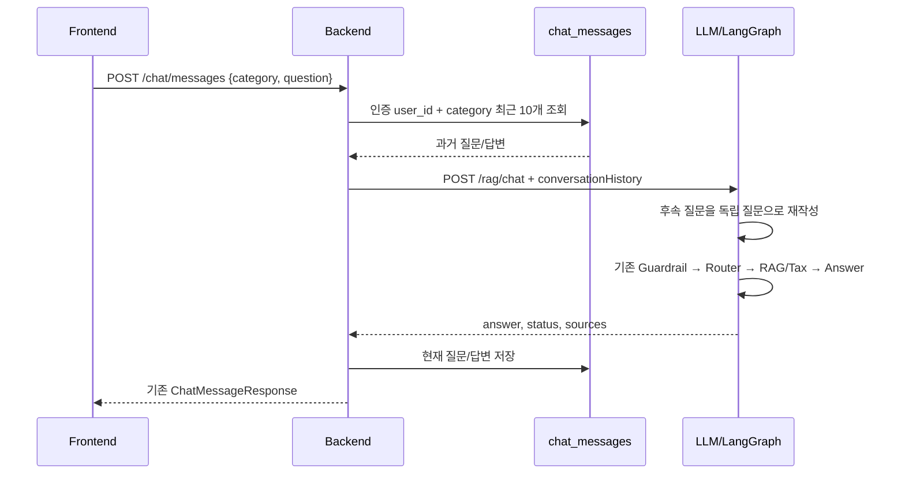

# 사용자별 대화 메모리 — 계획 및 작업 배분 검수서

## 1. 작업 이유

현재 서비스는 로그인 사용자의 질문과 답변을 `chat_messages`에 저장하지만 다음 요청에는
과거 대화를 전달하지 않는다. 따라서 화면에 직전 문장이 보여도 LLM은 “그건?”, “두 명이면?”
같은 후속 질문이 무엇을 가리키는지 알 수 없다. 새로고침하면 Frontend의 React state도
초기화돼 저장된 기록이 화면에 나타나지 않는다.

이 작업의 목표는 다음 두 가지다.

1. Backend DB 기록을 이용해 LLM이 사용자별 후속 질문을 이해한다.
2. 로그인 사용자가 화면을 다시 열어도 저장된 질문·답변을 복원한다.

LangGraph `InMemorySaver`는 서버 재시작과 다중 프로세스에서 유실될 수 있으므로 사용하지
않는다. 기존 DB를 영속 기록의 단일 원본으로 유지한다.

## 2. 확정 구조



Frontend 새로고침 시에는 기존 `GET /chat/messages?category=...`를 호출해 화면만 복원한다.
Frontend가 history를 질문 문자열에 붙이거나 user ID를 직접 보내지 않는다.

## 3. 공통 계약

대화 단위는 `user_id + category`별 단일 스레드이며 여러 대화방과 `conversation_id`는 제외한다.

Backend→LLM에만 다음 선택 필드를 추가한다.

```json
{
  "conversationHistory": [
    {"role":"user","content":"월급은 320만원이야"},
    {"role":"assistant","content":"..."}
  ]
}
```

- 완료된 대화 최대 10쌍, 메시지 최대 20개
- 오래된 순서부터 전달하며 `user → assistant` 쌍을 유지
- 질문 최대 1,000자, 답변 최대 4,000자
- 전체 content 최대 12,000자; 초과 시 가장 오래된 쌍부터 제거
- 현재 질문은 기존 `question`에만 포함
- history 누락/빈 배열은 기존 단일 질문과 호환
- 과거 assistant 답변은 대화 문맥이며 RAG·법적 근거나 인용 출처가 아님

Frontend→Backend `POST /chat/messages`와 DB schema는 변경하지 않는다.

## 4. 담당 배분 검수

| 요구사항 | 담당 | 작업서 | 배분 근거 |
| --- | --- | --- | --- |
| 인증 사용자 기록 조회·길이 제한 | Backend | `CHAT_MEMORY_BACKEND.md` | 인증과 `chat_messages` 소유자가 Backend임 |
| LLM 요청에 history 전달 | Backend | `CHAT_MEMORY_BACKEND.md` | 내부 HTTP client가 Backend에 있음 |
| 후속 질문 독립화 | LLM | `CHAT_MEMORY_LLM.md` | Router/RAG 전에 처리해야 함 |
| history schema 검증 | LLM | `CHAT_MEMORY_LLM.md` | `/rag/chat` 계약 소유자가 LLM임 |
| 이전 답변을 근거와 분리 | LLM | `CHAT_MEMORY_LLM.md` | Prompt·출처 검증 책임이 LLM에 있음 |
| 새로고침 후 화면 복원 | Frontend | `CHAT_MEMORY_FRONTEND.md` | React state와 렌더링 책임임 |
| 기록 삭제 UI | Frontend | `CHAT_MEMORY_FRONTEND.md` | Backend DELETE API는 이미 존재함 |
| 사용자 격리 | Backend 중심, 전체 검증 | Backend 작업서 | Frontend가 user ID를 지정하면 안 됨 |

배분은 현재 코드의 책임 경계와 일치한다. 각 담당자는 자기 폴더만 수정하며 공통 계약을
임의로 바꾸지 않는다.

## 5. 담당 문서

- `CHAT_MEMORY_LLM.md`: LLM schema, 질문 재작성 node, Graph 연결과 테스트
- `CHAT_MEMORY_BACKEND.md`: 사용자별 기록 조회, 길이 제한, LLM payload와 테스트
- `CHAT_MEMORY_FRONTEND.md`: 기록 복원, seed 분리, 삭제 UI와 build

계약 충돌 시 이 문서의 3절을 우선한다. 구현 세부사항은 각 담당 문서를 따른다.

## 6. 병합 및 통합 순서

각자 브랜치에서 병렬 구현할 수 있지만 병합·검증은 다음 순서로 한다.

1. LLM: 새 필드는 선택값이므로 기존 Backend와 먼저 호환 가능
2. Backend: LLM이 history를 받을 수 있게 된 뒤 전달 시작
3. Frontend: 기존 Backend 기록 API를 이용하므로 마지막 병합
4. 통합 담당: 문서 계약, 전체 테스트, 실제 사용자 시나리오 검증

담당별 병합 전 자기 폴더 밖 변경이 없는지 `git diff --name-only`로 확인한다. 기존 작업
트리 변경을 reset/checkout하거나 파일 전체를 과거 버전으로 덮어쓰지 않는다.

## 7. 통합 완료 기준

- 사용자 A의 기록이 사용자 B 화면·LLM 문맥에 포함되지 않는다.
- 같은 사용자의 `tax`와 `policy` 기록이 섞이지 않는다.
- 첫 질문은 기존 단일 질문과 동일하게 동작한다.
- “월급 320만원” 다음 “가족이 두 명이면?”에 이전 급여가 반영된다.
- 이전 assistant 답변만으로 법령·정책 출처를 생성하지 않는다.
- 새로고침과 재로그인 후 기록이 복원된다.
- category별 삭제 후 화면과 다음 LLM 문맥이 모두 비워진다.
- 기존 `status`, `guardrailReason`, `llmUsed`, `needsConfirmation`, `ragUsable` 동작이 유지된다.
- LLM 전체 pytest, Backend memory unittest, Frontend build가 통과한다.

## 8. 제외 및 주의사항

- 여러 대화방, 제목, 보관함, 대화 요약은 이번 범위에서 제외한다.
- Docker, DB schema, DB host 설정은 수정하지 않는다.
- 이 구조에서는 Backend가 history를 전달하므로 Backend와 LLM이 같은 물리 DB를 직접 읽을
  필요는 없다. 단, 전체 서비스 데이터 정합성을 위한 DB 설정 문제는 별도 과제다.
- 실제 OpenAI/Cohere 호출, 재색인, DB 변경은 사전 승인 없이 실행하지 않는다.

