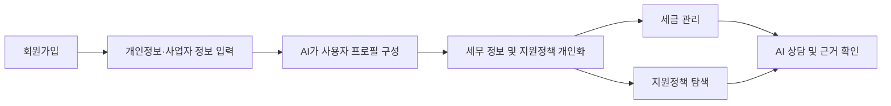
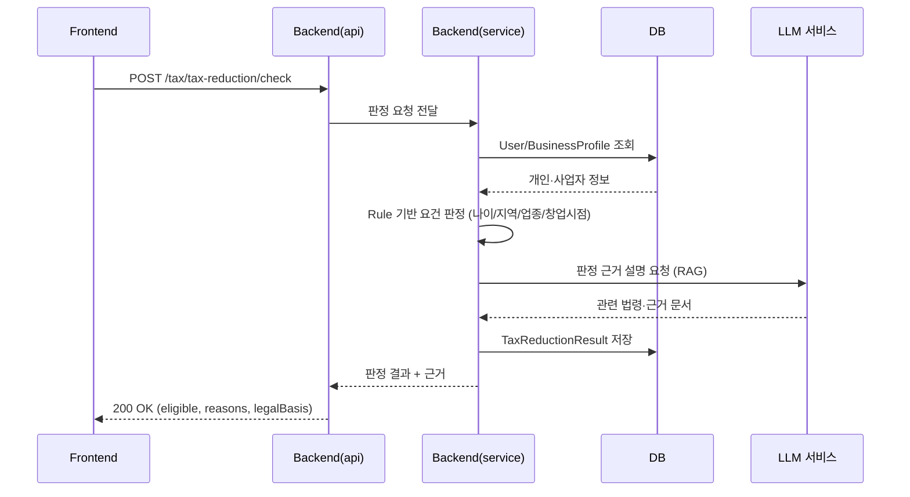

# 청년·1인 창업자 AI 행정·재정 지원 플랫폼

> LLM과 RAG(Retrieval-Augmented Generation) 기술을 연동한 내외부 문서 기반 질의응답 시스템으로, 청년·1인 창업자의 세무 관리와 정부·지자체 지원정책 탐색을 지원하는 AI 업무지원 플랫폼

---

## 📑 목차

- [1. 팀 소개](#1-팀-소개)
- [2. 프로젝트 개요](#2-프로젝트-개요)
- [3. 기술 스택](#3-기술-스택)
- [4. 데이터 및 AI 기술](#4-데이터-및-ai-기술)
- [5. 프로젝트 수행 범위](#5-프로젝트-수행-범위)
- [6. 저장소 구조](#6-저장소-구조)
- [7. 요구사항 명세서](#7-요구사항-명세서)
- [8. ERD](#8-erd)
- [9. 주요 프로시저](#9-주요-프로시저)
- [10. WBS](#10-wbs)
- [11. 수행결과](#11-수행결과)
- [12. 트러블슈팅](#12-트러블슈팅)
- [13. 향후 확장](#13-향후-확장)
- [14. 실행 방법](#14-실행-방법)
- [15. 한 줄 회고](#15-한-줄-회고)

---

## 1. 팀 소개

### 팀명

**SKN34-3rd-3Team**


### 팀원

| 이름 | 담당 | 설명 |
| :---: | :---: | :---: |
| [김태윤](https://github.com/여기_GitHub_계정) | **PM** | `[TODO]` |
| [김현지](https://github.com/여기_GitHub_계정) | **DB** | 데이터 수집 · DB 구현 |
| [전진영](https://github.com/여기_GitHub_계정) | **Backend** | `[TODO]` |
| [채정석](https://github.com/여기_GitHub_계정) | **Frontend** | `[TODO]` |
| [황호순](https://github.com/여기_GitHub_계정) | **LLM** | `[TODO]` |


---

## 2. 프로젝트 개요

### 프로젝트명

**청년·1인 창업자 AI 행정·재정 지원 플랫폼**

### 프로젝트 소개

청년·1인 창업자는 세금, 세액감면, 정부·지자체 지원사업 등 다양한 행정 정보를 직접 찾아보고 자신의 조건에 해당하는지 판단해야 함.   
그러나 관련 정보가 여러 기관과 공고문에 분산되어 있고, 법령 및 지원 조건이 복잡해 필요한 혜택을 놓치는 경우가 많음.

본 프로젝트는 사용자의 사업자 정보와 개인 조건을 기반으로 세무 정보와 정부·지자체 지원정책을 통합적으로 탐색하고 안내하는 AI 업무지원 플랫폼을 개발. 


### 프로젝트 필요성(배경)

- 세금 및 세액감면 조건이 복잡하여 스스로 판단하기 어려움
- 정부·지자체 지원사업이 여러 기관에 분산되어 있음
- 긴 공고문을 직접 읽고 지원 대상 및 신청 조건을 확인해야 함
- 일반 AI에게 질문할 경우 존재하지 않는 정책이나 부정확한 세무 정보를 제공할 위험이 있음

### 프로젝트 목표

- 환각을 방지하고 원하는 내외부 데이터 범위 안에서 RAG 기반 LLM 질의응답 시스템을 구현하여, 근거 없는 정책·세무 정보를 제공하는 위험을 차단.
- 세법·정책 문서를 벡터 형태로 임베딩하여 벡터데이터베이스에 저장하고 검색.
- LangChain을 활용해 벡터데이터베이스와 LLM을 연동하고, 조건 기반 판정 로직과 결합해 사용자 맞춤 답변을 제공.

### 핵심 기능

#### ① AI 세무 Assistant
- 사업자등록 유형 진단
- 사용자 맞춤 세금 정보 제공
- 세금 신고·납부 일정 및 지원금 신청기한을 통합한 홈 화면 캘린더
- 맞춤형 세금 리마인더
- 경비처리·절세 Q&A
- 세법 및 국세청 자료 기반 RAG 답변

#### ② 청년창업 세액감면 자동 판정
사용자의 나이, 지역, 업종, 창업 여부 및 창업 시점 등의 조건을 분석하여 청년창업 세액감면 요건 충족 여부를 자동으로 판정.

단순 LLM 답변이 아니라 조건 기반 판정 + 관련 법령 및 공식 자료를 근거로 결과를 제공.

#### ③ 맞춤형 지원금·정책 탐색
- 정부·지자체 지원사업 수집
- 사용자 조건 기반 맞춤 정책 추천
- 지원 자격 비교
- 신청기간 및 신청방법 안내(홈 화면 캘린더에 신청 마감일 연동)
- 관심 정책 저장

#### ④ 지원사업 공고문 AI 분석
공고문을 AI가 분석하여 다음 정보를 구조화함.
- 지원 대상
- 지원 내용 및 금액
- 신청 기간
- 신청 방법
- 제출 서류
- 주요 유의사항

또한 답변에 공식 출처와 근거 문서를 함께 제공하여 정보 신뢰성을 높임.

### 서비스 흐름




---

## 3. 기술 스택

| 구분 | 기술 |
| --- | --- |
| **Backend** |   |
| **LLM / AI** |     |
| **Database** |   |
| **Frontend** |   |
| **Infra** |  |
| **패키지 관리** |  |
| **협업** |   |


## 4. 데이터 및 AI 기술

<details>
<summary><b>데이터</b></summary>

- 국세청 및 관련 세법 자료
- 정부·지자체 지원사업 공고
- 온통청년, 정부24 등 공공 정책 데이터
- 지원사업 공고문 및 공식 안내자료

</details>

<details>
<summary><b>AI 기술</b></summary>

- **RAG**: 세법·정책 원문 문서를 벡터로 임베딩하여 벡터데이터베이스에 저장하고, 이를 근거로 검색·응답하여 환각을 방지
- **LangChain**: 벡터데이터베이스와 LLM을 연동해 RAG 파이프라인을 구성
- **LLM**: 자연어 상담 및 공고문 분석
- **Rule-based Engine**: 청년창업 세액감면 요건 자동 판정
- **Agent 구조**: 세무·정책 등 업무별 정보 검색 및 처리

</details>


## 5. 프로젝트 수행 범위

- 데이터 수집 및 가공
- 벡터데이터베이스 생성 및 데이터 저장
- One-shot 또는 Few-shot 활용 프롬프트 템플릿 작성
- 사용할 LLM 모델 선택
- LangChain 기반 RAG 기술로 벡터데이터베이스와 LLM 연동하여 질의응답 구현
- 구현 결과 테스트 및 개선

---

## 6. 저장소 구조

```
.
├── Backend/         # API 서버 (FastAPI, :8000)
├── Frontend/        # 사용자 화면 (React + Vite, :5173)
├── LLM/             # RAG 파이프라인, 임베딩, 프롬프트, 모델 서빙 (:8001)
├── DB/              # DB 스키마와 수집 스크립트
├── Docs/            # 기획·설계·진행 문서
│   ├── Design/      # 현재 유효한 설계 산출물
│   └── reports/     # 특정 시점의 검수·분석 보고서
├── docker-compose.yml
├── setup.sh         # 로컬 실행 (macOS / Linux / Git Bash)
├── setup.bat        # 로컬 실행 (Windows cmd.exe)
└── .env.example     # 환경변수 키 목록 (값은 비어 있음)
```

## 7. 요구사항 명세서


| 구분 | 기능ID | 기능명 |
| --- | --- | --- |
| 회원/프로필 | FS-01~04 | 회원가입, 로그인, 개인정보 관리, 사업자 정보 관리 |
| AI 상담(챗봇) | FS-05~08 | AI 챗봇 이용, 세금/경비처리/절세 Q&A, 정책 Q&A, 답변 근거 확인 |
| 세무 관리 | FS-09~13 | 사업자 유형 진단, 세금 정보 관리, 통합 일정 캘린더, 맞춤 리마인더, 청년창업 세액감면 자동판정 |
| 지출 분석 | FS-14~17 | 영수증 등록, 영수증 정보 추출(OCR), 지출 분류, 경비처리 가능성 분석 |
| 지원정책 탐색 | FS-18~23 | 지원정책 검색, 맞춤 정책 추천, 지원 자격 확인, 신청기간·방법 확인, 공고문 AI 요약, 관심 정책 저장 |
| 관리자 | FS-24~28 | 관리자 로그인, 사용자 관리, 세법·정책·공고문 데이터 관리, RAG 문서 관리, 시스템 모니터링 |

---

## 8. ERD

```mermaid
erDiagram
    users ||--o| business_profiles : has
    users ||--o{ chat_messages : sends
    chat_messages ||--o{ answer_sources : cites
    users ||--o| tax_info : manages
    calendar_events ||--o{ reminders : triggers
    users ||--o{ reminders : sets
    policies ||--o{ calendar_events : "due date of"
    policies ||--o{ rag_documents : "chunked into"
    users ||--o{ tax_reduction_results : requests
    users ||--o{ receipts : uploads
    receipts ||--o| receipt_extractions : "extracted as"
    receipts ||--o{ expenses : yields
    admin_users ||--o{ policies : manages
    policies ||--o{ announcements : posts
    announcements ||--o| announcement_summaries : "summarized as"
    users ||--o{ saved_policies : saves
    policies ||--o{ saved_policies : "saved by"
    admin_users ||--o{ tax_documents : uploads
    users ||--o{ calendar_events : "owns (USER type)"
    users ||--o{ notifications : receives

    users {
        int id PK
        string email
        string password_hash
        string name
        int age
        string region
        string phone
        string status "DEFAULT 'active'"
        datetime created_at
    }

    business_profiles {
        int id PK
        int user_id FK "UNIQUE"
        string business_type
        string industry
        date business_registered_at
        date founded_at
    }

    chat_messages {
        int id PK
        int user_id FK
        string category
        string question
        string answer
        datetime created_at
    }

    answer_sources {
        int id PK
        int message_id FK
        string title
        string url
        string excerpt
    }

    tax_info {
        int id PK
        int user_id FK
        string tax_type
        string details
        datetime updated_at
    }

    calendar_events {
        int id PK
        string event_type "TAX / POLICY / USER"
        string business_type "TAX 타입일 때만 사용"
        int policy_id FK "POLICY 타입일 때만 사용"
        int user_id FK "USER 타입일 때만 사용"
        string title
        date due_date
        string description
    }

    reminders {
        int id PK
        int user_id FK
        int event_id FK
        datetime notify_at
        boolean dispatched "DEFAULT false"
        datetime created_at
    }

    tax_reduction_results {
        int id PK
        int user_id FK
        boolean eligible
        string reasons
        string legal_basis
        datetime judged_at
    }

    receipts {
        int id PK
        int user_id FK
        string image_url
        string status "DEFAULT 'pending'"
        datetime created_at
    }

    receipt_extractions {
        int id PK
        int receipt_id FK "UNIQUE"
        date date
        string vendor
        int amount
        string items
    }

    expenses {
        int id PK
        int receipt_id FK
        int user_id FK
        string category
        int amount
        date date
        boolean deductible
        float deductible_confidence
        string deductible_basis
    }

    policies {
        int id PK
        int admin_id FK
        string title
        string region
        string industry
        string target
        string benefit
        string eligibility_rule
        string source
        datetime created_at
    }

    announcements {
        int id PK
        int policy_id FK
        string raw_content
        string source_url
        string apply_method
        date apply_start_date
        date apply_end_date
        datetime created_at
    }

    announcement_summaries {
        int id PK
        int announcement_id FK "UNIQUE"
        string target
        string benefit
        string period
        string documents
        string notes
        string source
        boolean llm_used "DEFAULT false"
    }

    saved_policies {
        int id PK
        int user_id FK "UNIQUE with policy_id"
        int policy_id FK "UNIQUE with user_id"
        datetime saved_at
    }

    admin_users {
        int id PK
        string email
        string password_hash
        string role
        datetime created_at
    }

    tax_documents {
        int id PK
        int admin_id FK
        string title
        string law_name
        string content
        string source
        datetime created_at
    }

    rag_documents {
        int id PK
        string source_type
        int source_id
        string chunk_id "UNIQUE"
        int policy_id FK
        string content
        string embedding_status
        vector embedding "VECTOR(1536), HNSW + vector_cosine_ops 인덱스"
        datetime updated_at
    }

    notifications {
        int id PK
        int user_id FK
        string kind
        string title
        string body
        string channel
        string status
        boolean read_flag "DEFAULT false"
        datetime created_at
    }
```



<details>
<summary><b>주요 테이블 관계 설명</b></summary>

- **User – BusinessProfile**: 1:1. 개인정보와 사업자 정보를 분리해 API도 별도 엔드포인트로 관리
- **CalendarEvent**: `event_type`이 `TAX`(세금 일정) / `POLICY`(지원정책 마감일) / `USER`(사용자 직접 등록) 세 값을 가지며, 공용 마스터 데이터와 사용자 소유 행이 한 테이블에 공존
- **RagDocument**: `source_type` + `source_id`로 `tax_documents`/`policies`/`announcements` 여러 테이블을 논리적으로 참조하고, `policy_id`는 `policies(id)`를 가리키는 실제 FK입니다. `policies` 행을 지우면 CASCADE로 관련 `rag_documents` 청크도 함께 삭제됨
- **Notification**: 앱 알림함·메일 대기열·브라우저 푸시를 한 테이블로 관리

</details>


---

## 9. 주요 프로시저


### ① 청년창업 세액감면 자동판정 (FS-13)

**Rule 기반 판정 + RAG 근거 제시**를 결합한 흐름

<details>

<summary><b> 판정 흐름도 </b></summary>



판정 자체는 Backend의 Service가 직접 수행하고, LLM 서비스에는 **근거 설명만** 요청. 판정값 자체를 LLM이 바꾸지 않음.

</details>

### ② AI 챗봇 Q&A + 답변 근거 확인 (FS-05, FS-06, FS-08)

<details>
<summary><b> Q&A 흐름 </b></summary>

1. Frontend가 `POST /chat/messages`로 질문 전송
2. Backend Service가 사용자·사업자 프로필과 모집 중 공고를 DB에서 조회해 `userContext`·`noticeResults`를 조립
3. LLM 서비스(`POST /rag/chat`)에 질문 + 조립된 컨텍스트 전달 → 답변 + 근거 문서 목록 반환
4. Backend가 `ChatMessage`·`AnswerSource`를 DB에 저장 후 응답
5. 이후 근거 확인(`GET /chat/messages/{id}/sources`)은 LLM을 다시 호출하지 않고 **저장된 근거를 DB에서만** 조회

<details>
<summary><b>LLM 서비스</b></summary>

**3번 단계(LLM 서비스) 내부 라우팅**: 질문마다 필요한 처리 방식이 달라 LangGraph로 분기 구조를 설계했다. 라우터 LLM이 질문을 **공고 / 정책 / 세금** 세 카테고리로 분류하고, 카테고리별로 다른 최적화 방식을 적용.

- **공고 질문**: LLM까지 가지 않아도 Backend에서 충분히 답변 가능하다고 판단해 Backend에서 바로 처리(위 2번 단계가 이미 처리)
- **정책 질문**: Dense 검색과 BM25를 RRF로 결합하고, Cohere Rerank로 한 번 더 정렬해 정답을 찾음
- **세금 질문**: 계산이 필요한 경우 국세청 세금 계산법을 함수화한 계산기를 호출하고, 그 결과값을 근거로 LLM이 답변. 계산이 필요 없고 법령 확인이 필요한 경우엔 정책 질문과 동일한 Dense+BM25+Rerank 흐름에 **multi-hop**(최대 3회)을 더해, 근거가 부족하면 질문을 다시 생성해 재검색

</details>

</details>


---

## 10. WBS

| 단계 | 작업 항목 | 상태 |
| --- | --- | :---: |
| **1. 주제 선택** | 아이디어 브레인스토밍 → 주제 후보 조사 → 주제 타당성·목적 구체화 → 주제 확정 | ✅ 완료 |
| **2. 요구사항 분석** | 기능 요구사항 정리 | ✅ 완료 |
| | 비기능 요구사항 정리 / 사용자(페르소나) 정의 / 우선순위 정리 | ✅ 완료 |
| **3. 설계** | 유스케이스·ERD·시퀀스·클래스 다이어그램 작성, API 명세 작성 | ✅ 완료 |
| | 화면 설계(와이어프레임) | ✅ 완료 |
| **4. 아키텍처 확정** | 기술 스택 확정 · 시스템 아키텍처 다이어그램 · 폴더/모듈 구조 · 환경변수 정리 | ✅ 완료 |
| **5. 구현** | DB 스키마 · Backend · LLM · Frontend 구현, 서비스 간 연동 | ✅ 완료 |
| **6. 테스트** | 단위 테스트(LLM 한정) | ✅ 완료 |
| | 통합 테스트 (실제 OpenAI·Cohere·PostgreSQL 연동 검증) | ⬜ 남음 |
| | 버그 수정 | 🔄 통합 결함 53건 중 35건 처리 |
| **7. 배포** | Docker 환경 구성(`docker-compose.yml`, `setup.sh`, `setup.bat`) | ✅ 완료 |
| | CI/CD 구성 / 배포 및 운영 점검 | ⬜ 미착수 |
| **8. 문서화** | DESIGN.md 작성 / 발표·데모 자료 준비 | 🔄 진행 중 |
| | README 작성 | 🔄 진행 중 |

---

## 11. 수행결과


## 12. 트러블슈팅


### 트러블슈팅 기록

평가 지표는 5가지 항목(route·status·block·grounded·required_phrases)을 종합해 산출.

| 지표 | 의미 |
| --- | --- |
| route | 올바른 경로로 분류됐는지 |
| status | 예상 응답 상태와 일치하는지 |
| block | 범위 밖 질문을 제대로 차단했는지 |
| grounded | 요구된 법령 근거·출처가 존재하는지 |
| required_phrases | 답변에 필수 핵심 표현이 포함됐는지 |

1. **세금 문서 범위 제한 시도** — 최초 평가셋(250건) 기준 종합 성능 지표가 64.3%로 목표치(70%) 미달. 세금 카테고리 질문은 세금 문서만 탐색하도록 제한해봤으나 개선 효과 없음.
2. **Router 프롬프트 수정** — 개인화 검색과 정책 ID 중복을 제거하고, Router 분기가 잘못 작동하는 것을 확인해 Router 프롬프트를 수정. 종합 성능 지표 **74.6%**로 기존 대비 **11.1%p 상승**.
3. **LLM 추론 강도 조정** — 질문 확인·라우터·답변 생성 단계의 LLM 추론 강도를 low로 설정. 정책 단일 질문 응답속도 **33.3% 단축**. 세금 질문은 4건 테스트 기준 8.8% 단축에 그쳐 효과 미미.
4. **Multi-hop 하이브리드 구조 시도** — 세금 질문 응답속도 개선을 위해 직렬 구조인 multi-hop을 병렬+직렬 하이브리드로 변경(첫 질문에서 쿼리 3개를 병렬로 생성하고, 근거가 부족하면 직렬 hop으로 이어감). 유의미한 속도 단축 없음.
5. **근거 판정 횟수 축소** — 단계별 소요 시간을 측정해 LLM의 근거 판정 단계가 병목임을 확인. hop마다 하던 근거 판정을 최종 1회로 축소하자 평균 응답속도 **4.85초 단축**됐지만 종합 성능 지표가 **66.1%로 하락**. 애매한 답변에만 추가 판정을 주는 방식도 시도했으나 품질이 더 떨어져 최종적으로 **미채택**.
6. **Hop 중간 질문 캐싱 도입 (최종 채택)** — 세금 질문 속도 개선을 위해 캐시를 도입. 최종 답변이 아니라 **hop 진행 중 생성되는 질문**을 캐시화해, 유사한 질문이 생성될 때 캐시된 데이터를 재사용(중복 데이터 없이 저장, 사용자가 많아질수록 응답속도가 빨라지는 구조). 종합 성능 지표는 유지하면서 평균 응답속도 **29.6% 감소**.

---

## 13. 향후 확장

1. **사업기획서 초안 작성**: 초기에는 세무 관리 + 지원금·정책 탐색을 핵심 기능으로 개발하고, 향후 창업 시 사용될 사업기획서 초안을 작성하는 기능까지 확장한다. 청년·1인 창업자의 창업 행정 업무 전반을 지원하는 AI 플랫폼을 목표로 함
2. **영수증을 통한 지출 분석**: 영수증 등의 지출 자료를 기반으로 OpenAI Vision 호출을 통해 영수증 정보 추출 → 지출 분류 → 지출 내역 분석 → 경비처리 가능성 안내 기능을 제공
3. **배포 범위 확대**: AWS를 사용한 웹사이트 배포 및 앱 배포


---

## 14. 실행 방법

`.env`는 비밀키가 들어 있어 git으로 공유되지 않는다. **팀에서 파일로 받아 저장소 루트에 두고** 시작한다. 스크립트는 `.env`를 만들어 주지 않는다.

```bash
./setup.sh                 # 전체 기동 후 Frontend 개발 서버까지 실행
./setup.sh --no-frontend   # 컨테이너만 기동하고 종료
```

Windows cmd.exe에서는 `setup.bat`을 같은 인자로 쓴다.

| 대상 | 주소 |
| --- | --- |
| 화면 | http://localhost:5173 |
| Backend API 문서 | http://localhost:8000/docs |
| LLM API 문서 | http://localhost:8001/docs |

- 로컬 개발에서는 `db`·`backend`·`llm`만 Docker Compose로 뜨고 **Frontend는 호스트에서 돈다.** Vite 프록시 대상이 호스트 주소이기 때문이다. compose의 `frontend` 서비스는 `frontend` 프로필에 묶여 있어 평소에는 빌드도 기동도 되지 않는다 (배포 섹션 참고)
- `Ctrl+C`는 Frontend만 멈춘다. 컨테이너까지 내리려면 `docker compose down`
- `OPENAI_API_KEY`가 없어도 화면·DB·정책 조회는 정상이고 AI 답변만 목업이 된다
- Docker Compose v2.1.1 이상이 필요하다. `setup.bat`의 메시지는 cmd.exe 인코딩 제약 때문에 영문이다
- 단계별 동작과 문제 해결은 `setup.sh` 상단 주석과 `Docs/STATUS.md` 3절 참고. LLM 서비스만 따로 띄우려면 `LLM/RUN_GUIDE.md`

---

## 15. 한 줄 회고


### 김태윤
> `[TODO: 회고 내용]`

### 김현지
> `[TODO: 회고 내용]`

### 전진영
> `[TODO: 회고 내용]`

### 채정석
> `[TODO: 회고 내용]`

### 황호순
> `[TODO: 회고 내용]`

---

## 배포 (학원 내부망)

<details>
<summary><b>펼쳐보기</b></summary>

팀원 한 명의 노트북이 서버가 되어 네 컨테이너를 모두 돌리고, 나머지 인원은 브라우저로 접속. nginx가 화면과 API를 같은 출처에서 서빙하므로 접속자는 Backend 주소를 알 필요가 없다.

### 서버 담당자

```bash
git clone <repo> && cd SKN34-3rd-3Team
# .env 는 git 으로 공유되지 않으므로 파일로 받아 저장소 루트에 둔다
docker compose --profile frontend up -d --build
```

`ipconfig` 로 내부망 IPv4를 확인해 팀에 공유한다. 시작 전에 두 가지를 해 둬야 한다.

1. **방화벽에서 80 포트를 연다.** 컨테이너가 `0.0.0.0:80` 에 바인딩해도 윈도우 인바운드 기본값이 차단이라 다른 기기에서는 막힌다. 관리자 PowerShell에서 실행한다.

   ```powershell
   New-NetFirewallRule -DisplayName "SKN34 app (HTTP 80)" -Direction Inbound -Protocol TCP -LocalPort 80 -Action Allow -Profile Domain,Private
   ```

   먼저 `Get-NetConnectionProfile` 로 현재 네트워크가 Domain·Private·Public 중 무엇으로 잡혀 있는지 보고 `-Profile` 을 맞춘다. 접속자는 80만 쓰므로 8000·8001·5432는 열지 않아도 된다.

2. **절전 모드를 끈다.** 호스트가 잠들면 전원이 들어와 있어도 접속이 끊긴다. 화면 끄기는 두어도 된다.

### 접속자

브라우저에 `http://<서버노트북IP>/` 를 친다. **그 외에 할 일이 없다.** 저장소도 Node도 Docker도 필요 없다.

화면이 호출하는 `/api/*` 는 접속한 주소로 되돌아와 nginx가 `backend:8000` 으로 넘긴다. 번들에는 상대 경로만 들어 있어 서버 IP가 바뀌어도 프론트를 다시 빌드할 필요가 없다.

### 한계

- DHCP라 서버 노트북의 IP가 바뀔 수 있다. 바뀌면 새 주소를 다시 공유한다
- 그 노트북을 끄거나 재우면 서비스가 멈춘다
- HTTPS가 없어 로그인 토큰이 평문으로 오간다. 내부망 시연 범위에서만 쓴다

### 상태 확인

기동 직후 AI 답변이 실제로 나오는지는 `curl -fsS http://<서버노트북IP>/api/health` 의 `ragReady` 로 판정한다. **true 여야 실답변이고, false 면 목업이 내려온다.** backend 는 llm 이 healthy 가 된 뒤에 뜨면서 RAG 인덱스를 한 번 깨우므로 정상 경로에서는 수동 재색인이 필요 없다. 인덱스는 `rag_documents` 의 기존 임베딩을 재사용하므로(`index_source: cache`) 기동만으로 임베딩 비용이 발생하지 않는다.

화면만 다시 배포하려면 `docker compose --profile frontend up -d --build frontend` 를 쓴다.

### 데이터가 없는 노트북이 서버를 맡을 때

`policies`·`rag_documents` 는 저장소에 없고 `DB/scripts` 의 수집 결과물이다. 서버 노트북의 볼륨은 비어서 시작하므로 데이터를 옮겨야 한다. 수집과 임베딩을 다시 돌리면 시간과 비용이 드니 덤프를 복원한다.

```bash
# 데이터가 있는 노트북에서
docker compose exec -T db pg_dump -U <user> -Fc <db> > startup_platform.dump
# 서버 노트북에서 (저장소 클론, .env 배치, db 컨테이너 기동 후)
docker compose exec -T db pg_restore -U <user> -d <db> --clean --if-exists < startup_platform.dump
```

복원 후 `GET /api/health` 의 `ragChunks` 가 10,523인지로 확인한다.

덤프를 옮기는 대신 서버 노트북의 `.env` 에 `COMPOSE_DB_HOST=<데이터 있는 노트북 IP>` 를 넣어 DB만 원격으로 쓸 수도 있다. `docker-compose.yml` 의 `DATABASE_URL` 이 이미 이 변수를 받으므로 코드 변경은 필요 없다. 다만 노트북 두 대가 모두 켜져 있어야 해서 실패 지점이 늘어난다.

</details>